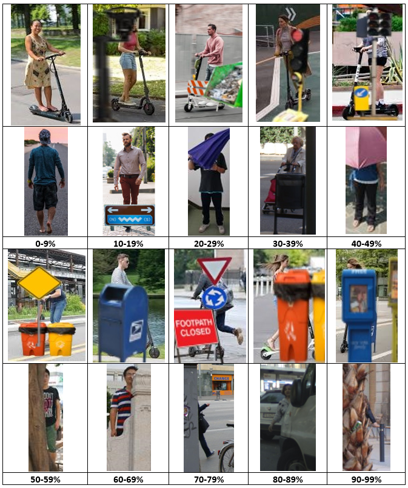

# E-Scooter Rider Detection Dataset
E-Scooter Rider Detection and Classification in Dense Urban Environments


Partially Occluded E-Scooter Rider Detection Dataset used in ["E-Scooter Rider Detection and Classification in Dense Urban Environments"](https://arxiv.org/pdf/2205.10184.pdf) Gilroy _et al_ 2022. 

 


This dataset contains 1,130 images including 543 e-scooter rider instances and 587 other vulnerable road user instances, for the characterization of detection and classification model performance for partially occluded e-scooter riders. Vulnerable road user instances are occluded by a diverse mix of objects across a range of occlusion levels from 0 to 99% occluded.

Images are annotated using the objective occlusion level annotation method described in [“Pedestrian Occlusion Level Classification using Keypoint Detection and 2D Body Surface Area Estimation”](https://openaccess.thecvf.com/content/ICCV2021W/OVIS/papers/Gilroy_Pedestrian_Occlusion_Level_Classification_Using_Keypoint_Detection_and_2D_Body_ICCVW_2021_paper.pdf) Gilroy _et al_ 2021. 


### Please cite the following work

[ArXiv2022](https://arxiv.org/abs/2205.04812)
```
@article{gilroy2022escooter,
  title={E-Scooter Rider Detection and Classification in Dense Urban Environments},
  author={Gilroy, Shane and Mullins, Darragh and Jones, Edward and Parsi, Ashkan and Glavin, Martin},
  journal={arXiv preprint arXiv:2205.10184},
  year={2022}
}
```


[ICCV2021](https://openaccess.thecvf.com/content/ICCV2021W/OVIS/papers/Gilroy_Pedestrian_Occlusion_Level_Classification_Using_Keypoint_Detection_and_2D_Body_ICCVW_2021_paper.pdf)
```
@inproceedings{gilroy2021pedestrian,
  title={Pedestrian Occlusion Level Classification using Keypoint Detection and 2D Body Surface Area Estimation},
  author={Gilroy, Shane and Glavin, Martin and Jones, Edward and Mullins, Darragh},
  booktitle={Proceedings of the IEEE/CVF International Conference on Computer Vision},
  pages={3833--3839},
  year={2021}
}
```
